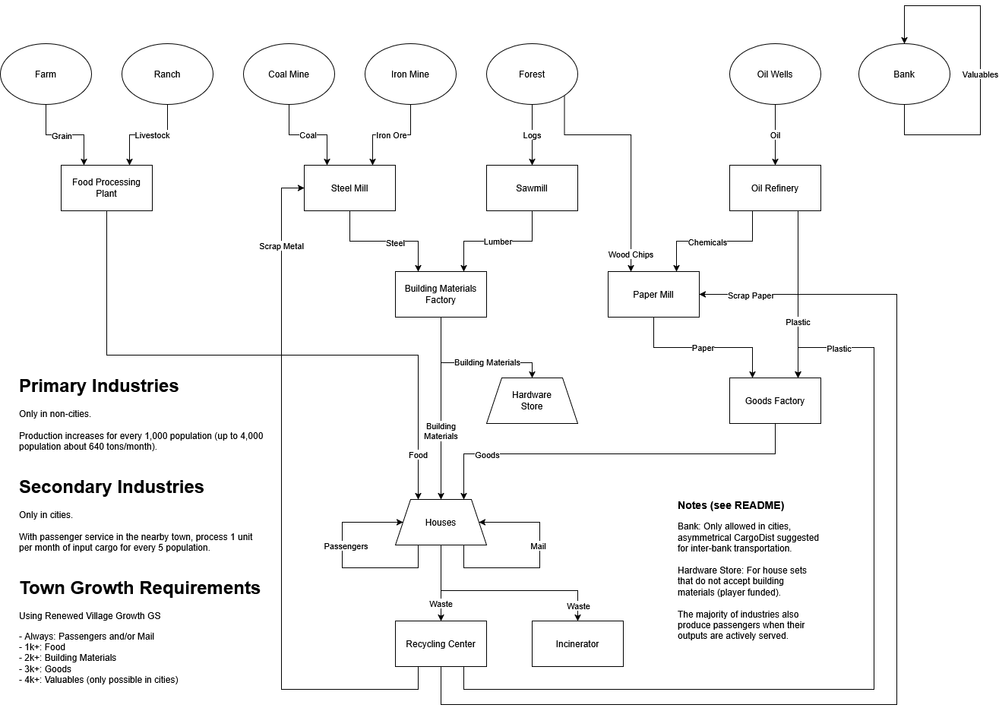

# Improved Town Industries 2

In most OpenTTD economies, towns have no relation to industrial production lines and are often seen as merely an impediment to rail infrastructure.

Improved Town Industries 2 makes town service integral to industrial production, and when used with a growth script like [Renewed Village Growth](https://github.com/F1rrel/RenewedVillageGrowth), makes for a challenging yet satisfying game loop.

(Jump to [Design Notes](#design-notes))

## Cargos and Industries

## Production Mechanics

In Improved Town Industries 2, industry production requires Passengers to be transported in the town which “owns” the industry (the one named in the industry name, e.g. “Flefingbridge Oil Wells”), however those passengers don’t have to travel to or from the industry itself.

There are two metrics which determine the production level of the industry: Town Population and percent of Passengers transported.

### Town Population

Primary industries increase their maximum production for each thousand population, up to 4,000 population and about 640 production per month.

Secondary industries consume one unit of input cargo per every five population, with no limit.

### Percent of Passengers transported

The maximum production determined by the population is multiplied by a Production Efficiency percentage, from 0% to 100%. The maximum efficiency is reached when 75% of the possible passengers produced in a month are carried (including by houses not served by any stations). Testing has shown this to be an achievable goal which still requires careful service planning and optimization.

These two goals together encourage players to both serve a town well, and encourage it to expand by supplying growth cargos.

## Industry Placement Rules

* Primary industries spawn only near towns (as opposed to cities), and are generated in "regions" if enabled in NewGRF parameters. They can be funded outside their set region, but must still be near a town (not a city) and may also have elevation requirements. Farms cannot be within 30 tiles of another Farm, to prevent field overlap.

* Secondary industries can only appear in cities, within about 15 tiles of the furthest house from the center. With the exception of Banks and Incinerators, only one secondary industry may appear in each city — to avoid cheesing the production mechanic with one big production city. Banks replace houses and must be facing a road in a city, and Incinerators must be at least 100 tiles from other Incinerators. These rules all apply even when funding an industry.

## Town Growth

ITI 2 is designed to be used with the [Renewed Village Growth](https://github.com/F1rrel/RenewedVillageGrowth) script, which adds cargo delivery requirements for towns to grow:
* 0+: Passengers
* 1,000+: Food
* 2,000+: Building Materials
* 3,000+: Goods
* 4,000+: Valuables (only possible in cities)

## Industry Regions

Primary industries only generate outside non-cities and are further grouped by region (this can be disabled in NewGRF parameters):
* N: Coal Mine
* NE: Forest
* SE: Farm
* S: Oil Wells
* SW: Ranch
* W: Iron Mine
* NW: Forest

Additionally, many primary industries have elevation requirements for varied, interesting gameplay.

Secondary industries and Banks only generate in cities.

## Additional Features

* Includes industry tile objects for visual expansion and decoration.
* Houses produce Waste, which reuses the Mail cargo ID for compatibility with all house sets.

## Limitations

* This industry set is designed for Temperate climate only, since it doesn't include snow sprites and Forest sprites are always snow-covered in Sub-Arctic climate.
* Some aircraft sets are hardcoded to carry cargo ID 2, not "MAIL", so they carry Waste.

## Translations

* English
* Arabic (AviationGamerX)
* French (arikover)
* Korean (telk5093)

Partial translations:

* Simplified Chinese (SuperCirno)
* Czech (adpro)
* German (WoelfiVW)
* Russian (demidovskiy)
* Swedish (En okänd välgörare)

Please feel free to translate into your language and submit a Pull Request.

## Design Notes

In my previous economy/industry NewGRFs `Industries of the Caribbean` and `Lumberjack Industries` I’ve used the Passengers produced by houses as Workers, required for industrial production and limited (in Lumberjack, at least) by a town growth script. This required players to build commuter lines to serve their factories and made for a more holistic approach to building a transportation company.

However, this method had its drawbacks, primarily in the unrealistic passenger network design; in fact a true “network” was ill-advised since CargoDist has no concept of how many workers are required by each factory. The best network was a simple collector network from nearby towns to funnel workers to busy factories. Additionally, workers did not return home from the factories.
